# &#8239;Matrix

Video game console operating system that displays on a 16*9 RGB LED matrix.

   
  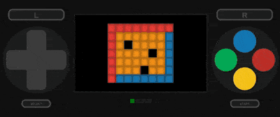
   
   

## Existing softwares

| | Name | Description | |
| - | - | - | - |
| 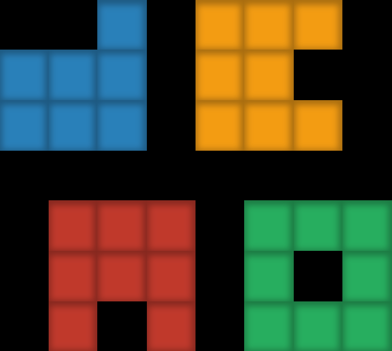 | Demo | A demo software that uses all drivers from the SDK. | 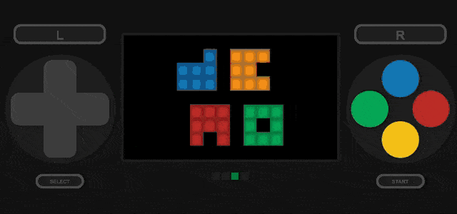 |
| 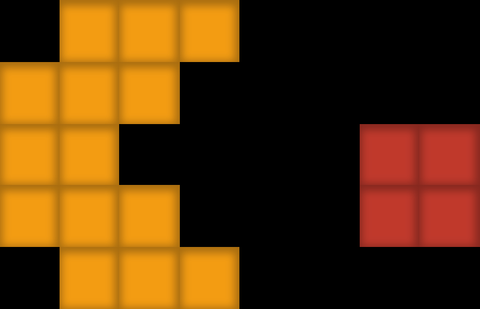 | Yumyum | Eat all the candies with your monster to win the game. | 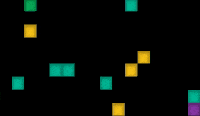 |
| 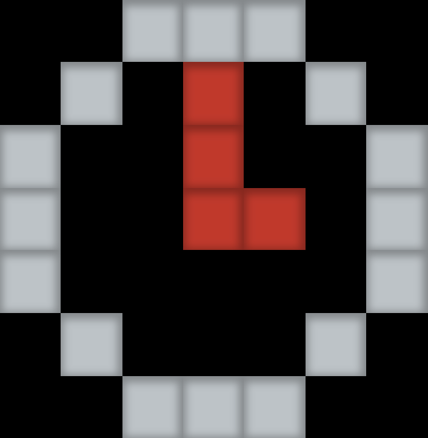 | Clock | What time is it? | 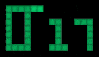 |
| 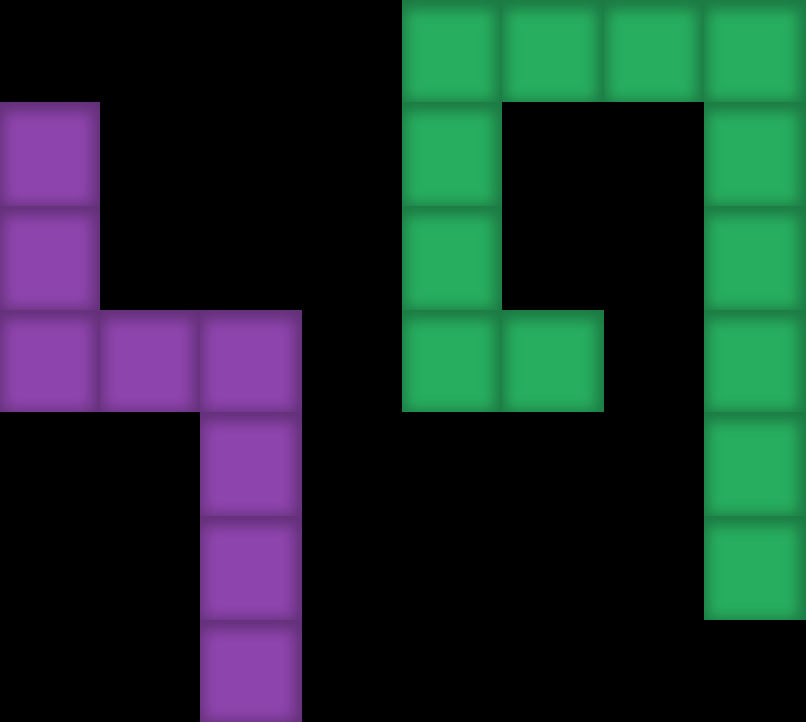 | Zigzag | Turn left then right, eat candies but not yourself. | 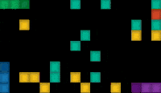 |
| 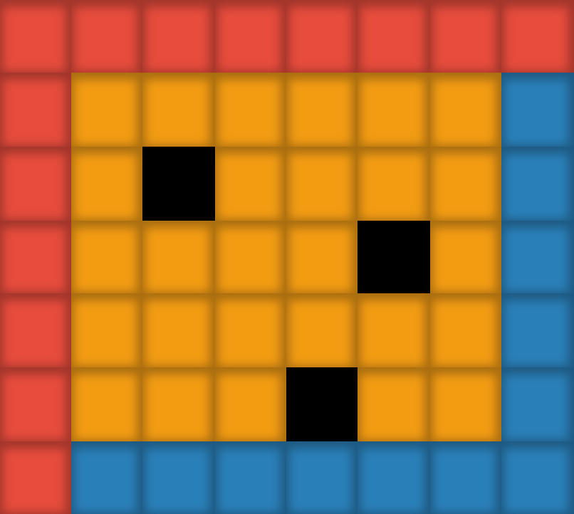 | Draw | For those who like pixel art. | 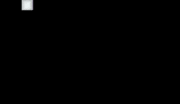 |
| 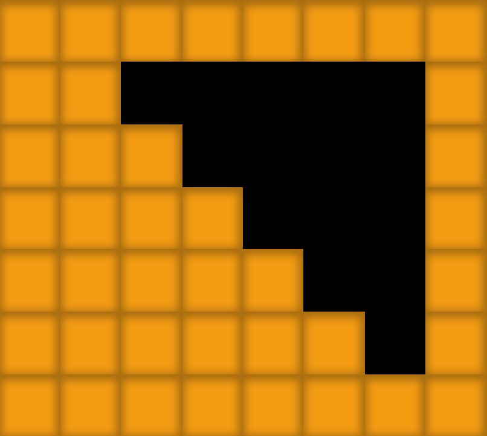 | Device | The Device software allows you to change the luminosity of the LEDs. | 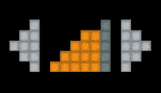 |
| 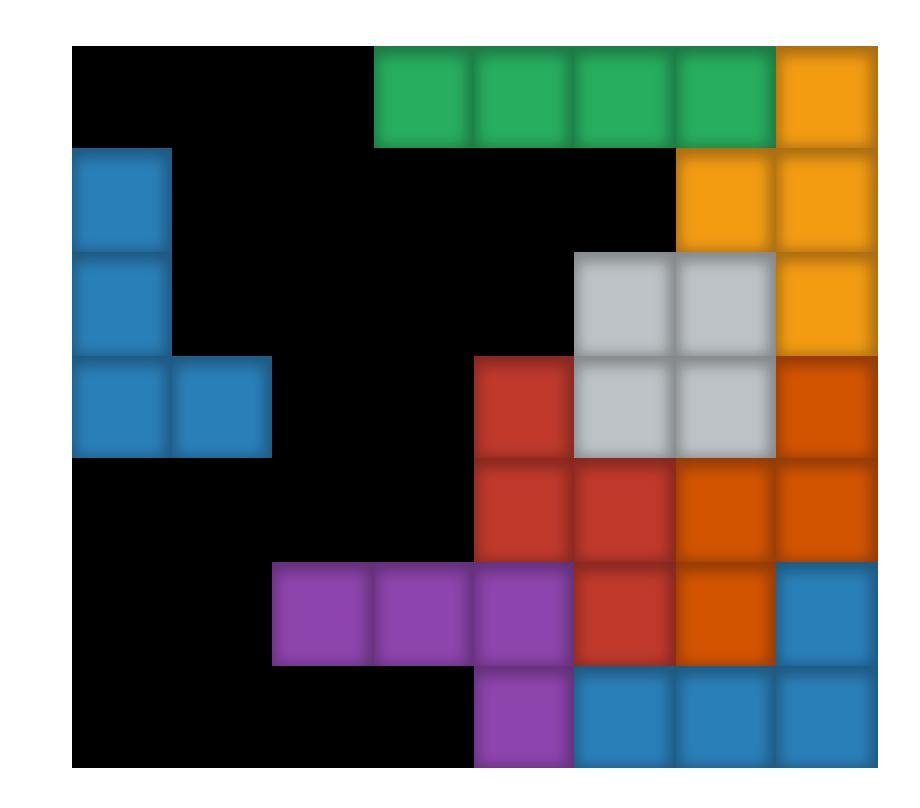 | Blocks | A puzzle game, score a maximum of points by clearing complete lines. |  |
| 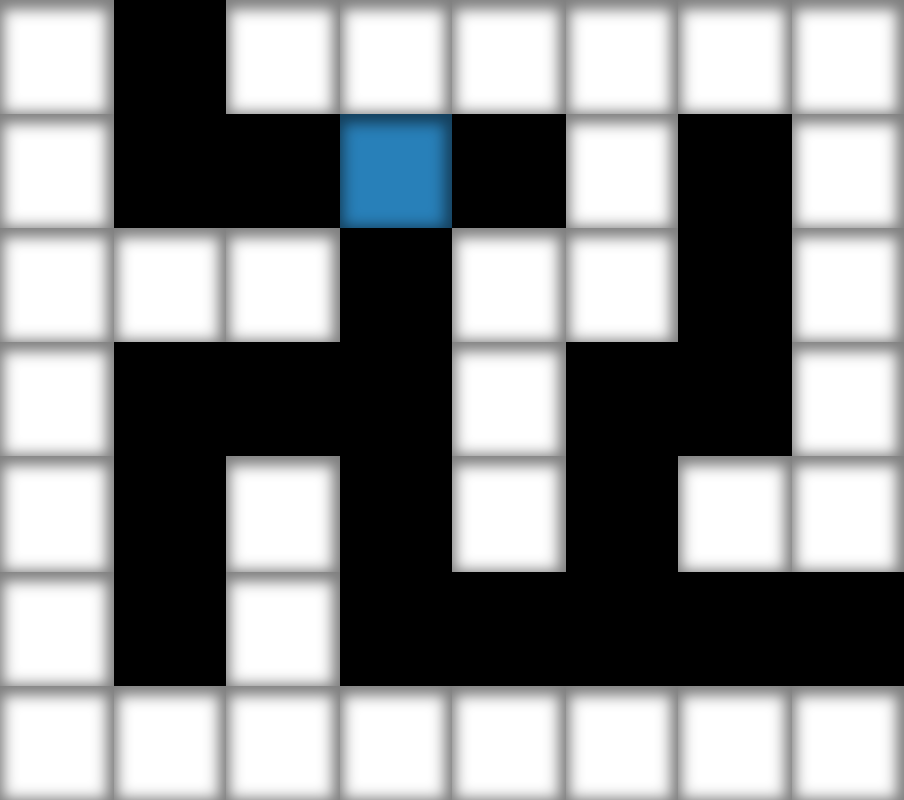 | Getout | A labyrinth game, try to get out if you can. | 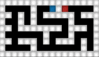 |
| 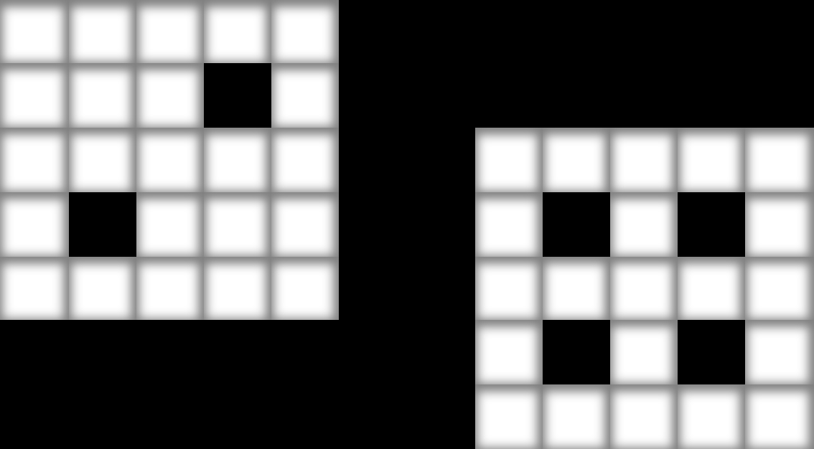 | Rollup dice | Roll two dice, press A for a new throw. | 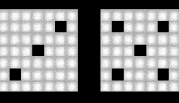 |
| 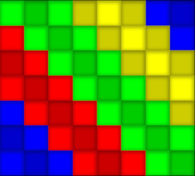 | Animate | Player for animations generated with Glediator (http://www.solderlab.de/index.php/software/glediator). | 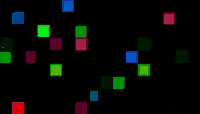 |
| 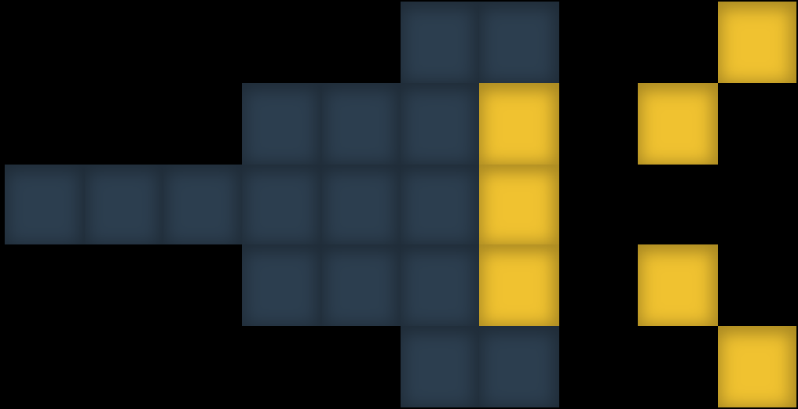 | Light | Simple software to generate mood light. | 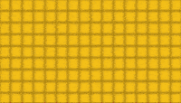 |

## Matrix types

There are 3 main types that exists in Matrix's sdk:
- A **display** receives a live stream of frames from core.
- A **player** sends actions for a slot to core, an action is a button press/release event.  
- A **software** receives player's actions from core and use sdk's rendering features to generate frames in Matrix core. 

## Matrix components

| Name | Description |
| - | - |
| Core | The heart of the Matrix system that managed software's lifecycle. All softwares, players and displays are connected to core. |
| Device | The component that interacts with usb controllers and Arduino. |
| Gamepad | A web application that contains a virtual controller with display. |
| Emulator | A web application built for development purpose. It displays Matrix main screen and player's screens. |

## Install

Matrix runs on a Raspberry Pi. On a Pi 2 or later there is a `.deb` in the
[releases](https://github.com/richardlt/matrix/releases) that installs a service starting
at boot; ARMv6 boards get an SD card staged by a script. Either way the Arduino has to be
flashed first.

- [Installing matrix](./docs/install.md)
- [Installing on an ARMv6 board, with Alpine](./docs/install-alpine.md)
- [Flashing the Arduino](./docs/arduino.md)

All components can run on the Pi, but any software can equally run on your desk against a
remote core with `--core-uri`.

## Contributing

See [development.md](./docs/development.md) for the development setup, the checks and how
the release artifacts are built.
